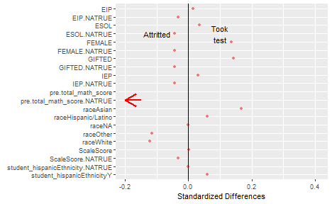
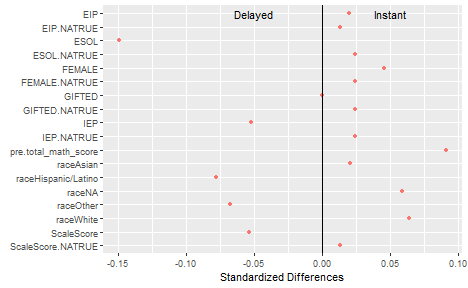
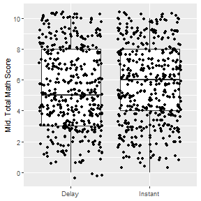
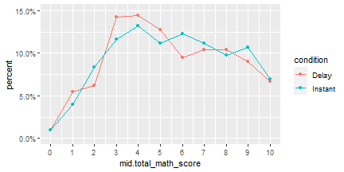
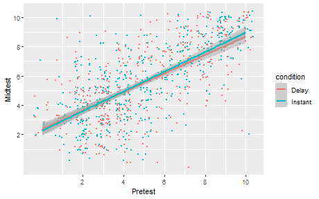

```
## [1] "table1.docx"
```

<table class="table" style="width: auto !important; margin-left: auto; margin-right: auto;">
 <thead>
  <tr>
   <th style="text-align:left;">   </th>
   <th style="text-align:left;">    </th>
   <th style="text-align:right;"> N </th>
   <th style="text-align:right;"> % </th>
  </tr>
 </thead>
<tbody>
  <tr>
   <td style="text-align:left;"> Gender </td>
   <td style="text-align:left;"> Female </td>
   <td style="text-align:right;"> 372 </td>
   <td style="text-align:right;"> 43.6 </td>
  </tr>
  <tr>
   <td style="text-align:left;">  </td>
   <td style="text-align:left;"> Male </td>
   <td style="text-align:right;"> 382 </td>
   <td style="text-align:right;"> 44.8 </td>
  </tr>
  <tr>
   <td style="text-align:left;">  </td>
   <td style="text-align:left;"> Unknown </td>
   <td style="text-align:right;"> 99 </td>
   <td style="text-align:right;"> 11.6 </td>
  </tr>
  <tr>
   <td style="text-align:left;"> Race/Ethnicity </td>
   <td style="text-align:left;"> Hispanic/Latino </td>
   <td style="text-align:right;"> 110 </td>
   <td style="text-align:right;"> 12.9 </td>
  </tr>
  <tr>
   <td style="text-align:left;">  </td>
   <td style="text-align:left;"> American Indian/Alaska Native </td>
   <td style="text-align:right;"> 6 </td>
   <td style="text-align:right;"> 0.7 </td>
  </tr>
  <tr>
   <td style="text-align:left;">  </td>
   <td style="text-align:left;"> Asian </td>
   <td style="text-align:right;"> 229 </td>
   <td style="text-align:right;"> 26.8 </td>
  </tr>
  <tr>
   <td style="text-align:left;">  </td>
   <td style="text-align:left;"> Black/African American </td>
   <td style="text-align:right;"> 32 </td>
   <td style="text-align:right;"> 3.8 </td>
  </tr>
  <tr>
   <td style="text-align:left;">  </td>
   <td style="text-align:left;"> Native Hawaiian or Other Pacific islander </td>
   <td style="text-align:right;"> 1 </td>
   <td style="text-align:right;"> 0.1 </td>
  </tr>
  <tr>
   <td style="text-align:left;">  </td>
   <td style="text-align:left;"> White </td>
   <td style="text-align:right;"> 443 </td>
   <td style="text-align:right;"> 51.9 </td>
  </tr>
  <tr>
   <td style="text-align:left;">  </td>
   <td style="text-align:left;"> Two or more races </td>
   <td style="text-align:right;"> 29 </td>
   <td style="text-align:right;"> 3.4 </td>
  </tr>
  <tr>
   <td style="text-align:left;">  </td>
   <td style="text-align:left;"> Unknown </td>
   <td style="text-align:right;"> 3 </td>
   <td style="text-align:right;"> 0.4 </td>
  </tr>
</tbody>
</table>


# Introduction

This document estimates the effect of immediate versus delayed feedback on the mid-test (total math score) in the FH2T RCT.
It is based on the 1589 subjects initially randomized between the two conditions, 795 randomized to the Instant condition, and 794 randomized to the delayed feedback condition.
Randomization was blocked within the 169 classrooms.

The following section discusses attrition--students who did not take the mid-assessment.

The next section estimates treatment effects.


# Attrition

When randomized subjects do not have outcome information in an RCT, effect estimates may be biased.
Randomization creates treatment groups that, in expectation, are identical in measured and unmeasured characteristics, referred to as "covariate balance."
However, attrition is not controlled by the researcher, nor is it random; in particular, if different types of subjects attrit in different treatment groups, the remaining subjects will not necessarily be comparable across groups.
That said, if the overall level of attrition is low, or if the level
of attrition is similar between the two treatment groups, and if important covariates remain balanced
between treatment groups after excluding attritors, the bias might be
negligible.

The What Works Clearinghouse publishes [standards for attrition bias][1]
based on the level of overall attrition as well as differential
attrition--the difference in attrition levels between treatment
groups. 


In practice, we will omit the 710 students without mid-test scores (and in some analyses, also the additional 26 students without pre-test scores). 
In 43 classrooms, no students took the mid-test, and in 2 additional classrooms, no student took both the pre- and the mid-test.
In 15 classrooms, there were no students with pre-test scores in one of the two treatment groups; these classrooms were dropped from all analyses other than Model 1, below. Dropping these entire classrooms enhances the validity of the analyses, but reduces the sample size by 23 students.

## Attrition Rates

The overall attrition for the mid-test was 45%--710 students out of 1589 did not complete the mid-test. 

<table>
<caption>Attrition by treatment group.</caption>
 <thead>
  <tr>
   <th style="text-align:left;">   </th>
   <th style="text-align:right;"> Delay </th>
   <th style="text-align:right;"> Instant </th>
  </tr>
 </thead>
<tbody>
  <tr>
   <td style="text-align:left;"> Attrit </td>
   <td style="text-align:right;"> 45.3 </td>
   <td style="text-align:right;"> 44 </td>
  </tr>
  <tr>
   <td style="text-align:left;"> Took Mid-Test </td>
   <td style="text-align:right;"> 54.7 </td>
   <td style="text-align:right;"> 56 </td>
  </tr>
</tbody>
</table>

Table \@ref(tab:attritionTable1) gives attrition by treatment
group. 
The differential attrition was -1.31%.
Taken together, the (high) overall attrition with the (low) differential attrition means that this study meets the conservative WWC standards. 

An important subgroup is composed of the 1223=77% of students who have pre-test scores. 
Among this subgroup, 853 also took the
mid-test, so attrition is much lower: 30%. 
The differential attrition is also acceptable: 
-0.45%.

## Attrition and Covariates

### Who Attritted?

    


Who attritted? Figure \@ref(fig:whoAttrit) shows standardized differences of covariates between students who attritted and those who took the mid-test. 
Students who took the test had higher pretest and 5th-grade scale scores, were more likely to be gifted, and more likely to be Asian that students who attritted. 
Students who attritted were much less likely to have taken the pre-test. 

### Covariate Balance among Test-Takers



<table>
 <thead>
  <tr>
   <th style="text-align:left;"> Covariate </th>
   <th style="text-align:right;"> Delayed </th>
   <th style="text-align:right;"> Instant </th>
   <th style="text-align:right;"> std.diff </th>
   <th style="text-align:left;"> Zscore </th>
  </tr>
 </thead>
<tbody>
  <tr>
   <td style="text-align:left;"> ESOL </td>
   <td style="text-align:right;"> 0.079 </td>
   <td style="text-align:right;"> 0.043 </td>
   <td style="text-align:right;"> -0.149 </td>
   <td style="text-align:left;"> -2.36* </td>
  </tr>
  <tr>
   <td style="text-align:left;"> pre.total_math_score </td>
   <td style="text-align:right;"> 4.766 </td>
   <td style="text-align:right;"> 5.008 </td>
   <td style="text-align:right;"> 0.091 </td>
   <td style="text-align:left;"> 2.08* </td>
  </tr>
  <tr>
   <td style="text-align:left;"> raceHispanic/Latino </td>
   <td style="text-align:right;"> 0.139 </td>
   <td style="text-align:right;"> 0.112 </td>
   <td style="text-align:right;"> -0.078 </td>
   <td style="text-align:left;"> -1.2 </td>
  </tr>
  <tr>
   <td style="text-align:left;"> raceOther </td>
   <td style="text-align:right;"> 0.091 </td>
   <td style="text-align:right;"> 0.072 </td>
   <td style="text-align:right;"> -0.068 </td>
   <td style="text-align:left;"> -0.94 </td>
  </tr>
  <tr>
   <td style="text-align:left;"> raceWhite </td>
   <td style="text-align:right;"> 0.502 </td>
   <td style="text-align:right;"> 0.534 </td>
   <td style="text-align:right;"> 0.064 </td>
   <td style="text-align:left;"> 1.09 </td>
  </tr>
  <tr>
   <td style="text-align:left;"> raceNA </td>
   <td style="text-align:right;"> 0.002 </td>
   <td style="text-align:right;"> 0.006 </td>
   <td style="text-align:right;"> 0.059 </td>
   <td style="text-align:left;"> 0.82 </td>
  </tr>
  <tr>
   <td style="text-align:left;"> ScaleScore </td>
   <td style="text-align:right;"> 0.133 </td>
   <td style="text-align:right;"> 0.080 </td>
   <td style="text-align:right;"> -0.053 </td>
   <td style="text-align:left;"> -1.08 </td>
  </tr>
  <tr>
   <td style="text-align:left;"> IEP </td>
   <td style="text-align:right;"> 0.085 </td>
   <td style="text-align:right;"> 0.071 </td>
   <td style="text-align:right;"> -0.052 </td>
   <td style="text-align:left;"> -0.78 </td>
  </tr>
</tbody>
</table>

Are instant- and delayed-feedback non-attritors comparable? 
Figure \@ref(fig:balAttrit) compares the two treatment groups among those who took the mid-test. 
A p-value testing overall balance was $p=$0.204, meaning that the groups were more balanced than 20% of randomized experiments.

The only notable difference was that delayed feedback students who took the mid-test tend to be more likely to be ESOL than those in the instant-feedback condition.

These results suggest that confounding bias due to attrition is unlikely to be a major concern.
Nevertheless, we adjust for pre-treatment covariates in one of the models below.

# Growth


```
## 
## 	One Sample t-test
## 
## data:  smallDat$mid.total_math_score - smallDat$pre.total_math_score
## t = 8.4563, df = 831, p-value < 2.2e-16
## alternative hypothesis: true mean is not equal to 0
## 95 percent confidence interval:
##  0.4863890 0.7804379
## sample estimates:
## mean of x 
## 0.6334135
```

# Treatment Effects



Figure \@ref(fig:boxplot) gives boxplots of the total scores for the two treatment conditions, with individual scores plotted as jittered points. 
The median score for Instant-feedback students is one point higher than the median for delayed-feedback students, but there is wide variation in both groups.



Figure \@ref(fig:byScore) shows the percent of students in each treatment group who achieved each possible score on the mid-test. 
A slightly higher percentage of delayed-feedback students scored 3, 4, or 5, and a slightly higher percentage of instant-feedback students scored 6 or 9.



    
Figure \@ref(fig:prePostScatter) gives a scatterplot of pre-test vs post-test scores with separate OLS fits in each treatment group. The best-fit lines are almost identical, but not quite--ignoring statistical error, it appears that students with very high pre-test scores did better on the mid-test if they were in the Instant condition, while students with very low pre-test scores did better on the mid-test if they were in the Delay condition. 
We can test this with an OLS model below.
	
Table \@ref(tab:ols) give the results of OLS models estimating the effect of assignment to the instant- versus delayed-feedback condition on mid-tests.
Model 1 is just a comparison of the mean test scores.
Models 2-4 also include fixed-effects for classroom (the randomization blocks). 
These estimate a weighted-average treatment effect, where the weights are chosen to maximize precision.
Models 3-4 adjust for covariates, and include only students with pretest scores. 
All standard errors are heteroskedasticity-consistent, estimated using the `estimatr` package in `R`.


<table class="texreg" style="margin: 10px auto;border-collapse: collapse;border-spacing: 0px;caption-side: bottom;color: #000000;border-top: 2px solid #000000;">
<caption>OLS models estimating the effect of assignment to the instant feedback condition versus the delayed feedback condition. Confidence intervals are in brackets under coefficient estimates.</caption>
<thead>
<tr>
<th style="padding-left: 5px;padding-right: 5px;">&nbsp;</th>
<th style="padding-left: 5px;padding-right: 5px;">Model 1</th>
<th style="padding-left: 5px;padding-right: 5px;">Model 2</th>
<th style="padding-left: 5px;padding-right: 5px;">Model 3</th>
<th style="padding-left: 5px;padding-right: 5px;">Model 4</th>
<th style="padding-left: 5px;padding-right: 5px;">Model 5</th>
</tr>
</thead>
<tbody>
<tr style="border-top: 1px solid #000000;">
<td style="padding-left: 5px;padding-right: 5px;">conditionInstant</td>
<td style="padding-left: 5px;padding-right: 5px;">0.24</td>
<td style="padding-left: 5px;padding-right: 5px;">0.19</td>
<td style="padding-left: 5px;padding-right: 5px;">0.19</td>
<td style="padding-left: 5px;padding-right: 5px;">0.19</td>
<td style="padding-left: 5px;padding-right: 5px;">0.19</td>
</tr>
<tr>
<td style="padding-left: 5px;padding-right: 5px;">&nbsp;</td>
<td style="padding-left: 5px;padding-right: 5px;">[-0.02; 0.50]</td>
<td style="padding-left: 5px;padding-right: 5px;">[-0.06; 0.44]</td>
<td style="padding-left: 5px;padding-right: 5px;">[-0.06; 0.44]</td>
<td style="padding-left: 5px;padding-right: 5px;">[-0.05; 0.44]</td>
<td style="padding-left: 5px;padding-right: 5px;">[-0.06; 0.44]</td>
</tr>
<tr>
<td style="padding-left: 5px;padding-right: 5px;">pretest</td>
<td style="padding-left: 5px;padding-right: 5px;">&nbsp;</td>
<td style="padding-left: 5px;padding-right: 5px;">0.31<sup>*</sup></td>
<td style="padding-left: 5px;padding-right: 5px;">0.30<sup>*</sup></td>
<td style="padding-left: 5px;padding-right: 5px;">0.28<sup>*</sup></td>
<td style="padding-left: 5px;padding-right: 5px;">0.27<sup>*</sup></td>
</tr>
<tr>
<td style="padding-left: 5px;padding-right: 5px;">&nbsp;</td>
<td style="padding-left: 5px;padding-right: 5px;">&nbsp;</td>
<td style="padding-left: 5px;padding-right: 5px;">[ 0.22; 0.40]</td>
<td style="padding-left: 5px;padding-right: 5px;">[ 0.21; 0.39]</td>
<td style="padding-left: 5px;padding-right: 5px;">[ 0.19; 0.38]</td>
<td style="padding-left: 5px;padding-right: 5px;">[ 0.17; 0.37]</td>
</tr>
<tr>
<td style="padding-left: 5px;padding-right: 5px;">ScaleScore</td>
<td style="padding-left: 5px;padding-right: 5px;">&nbsp;</td>
<td style="padding-left: 5px;padding-right: 5px;">0.47<sup>*</sup></td>
<td style="padding-left: 5px;padding-right: 5px;">0.42<sup>*</sup></td>
<td style="padding-left: 5px;padding-right: 5px;">0.47<sup>*</sup></td>
<td style="padding-left: 5px;padding-right: 5px;">0.42<sup>*</sup></td>
</tr>
<tr>
<td style="padding-left: 5px;padding-right: 5px;">&nbsp;</td>
<td style="padding-left: 5px;padding-right: 5px;">&nbsp;</td>
<td style="padding-left: 5px;padding-right: 5px;">[ 0.27; 0.67]</td>
<td style="padding-left: 5px;padding-right: 5px;">[ 0.21; 0.63]</td>
<td style="padding-left: 5px;padding-right: 5px;">[ 0.27; 0.67]</td>
<td style="padding-left: 5px;padding-right: 5px;">[ 0.21; 0.63]</td>
</tr>
<tr>
<td style="padding-left: 5px;padding-right: 5px;">ESOL1</td>
<td style="padding-left: 5px;padding-right: 5px;">&nbsp;</td>
<td style="padding-left: 5px;padding-right: 5px;">0.35</td>
<td style="padding-left: 5px;padding-right: 5px;">0.45</td>
<td style="padding-left: 5px;padding-right: 5px;">0.33</td>
<td style="padding-left: 5px;padding-right: 5px;">0.43</td>
</tr>
<tr>
<td style="padding-left: 5px;padding-right: 5px;">&nbsp;</td>
<td style="padding-left: 5px;padding-right: 5px;">&nbsp;</td>
<td style="padding-left: 5px;padding-right: 5px;">[-0.32; 1.02]</td>
<td style="padding-left: 5px;padding-right: 5px;">[-0.25; 1.15]</td>
<td style="padding-left: 5px;padding-right: 5px;">[-0.34; 0.99]</td>
<td style="padding-left: 5px;padding-right: 5px;">[-0.27; 1.12]</td>
</tr>
<tr>
<td style="padding-left: 5px;padding-right: 5px;">IEP1</td>
<td style="padding-left: 5px;padding-right: 5px;">&nbsp;</td>
<td style="padding-left: 5px;padding-right: 5px;">-0.18</td>
<td style="padding-left: 5px;padding-right: 5px;">-0.13</td>
<td style="padding-left: 5px;padding-right: 5px;">-0.19</td>
<td style="padding-left: 5px;padding-right: 5px;">-0.14</td>
</tr>
<tr>
<td style="padding-left: 5px;padding-right: 5px;">&nbsp;</td>
<td style="padding-left: 5px;padding-right: 5px;">&nbsp;</td>
<td style="padding-left: 5px;padding-right: 5px;">[-0.58; 0.23]</td>
<td style="padding-left: 5px;padding-right: 5px;">[-0.59; 0.33]</td>
<td style="padding-left: 5px;padding-right: 5px;">[-0.59; 0.22]</td>
<td style="padding-left: 5px;padding-right: 5px;">[-0.61; 0.32]</td>
</tr>
<tr>
<td style="padding-left: 5px;padding-right: 5px;">raceHispanic/Latino</td>
<td style="padding-left: 5px;padding-right: 5px;">&nbsp;</td>
<td style="padding-left: 5px;padding-right: 5px;">-0.23</td>
<td style="padding-left: 5px;padding-right: 5px;">-0.22</td>
<td style="padding-left: 5px;padding-right: 5px;">-0.23</td>
<td style="padding-left: 5px;padding-right: 5px;">-0.21</td>
</tr>
<tr>
<td style="padding-left: 5px;padding-right: 5px;">&nbsp;</td>
<td style="padding-left: 5px;padding-right: 5px;">&nbsp;</td>
<td style="padding-left: 5px;padding-right: 5px;">[-0.73; 0.26]</td>
<td style="padding-left: 5px;padding-right: 5px;">[-0.71; 0.28]</td>
<td style="padding-left: 5px;padding-right: 5px;">[-0.72; 0.27]</td>
<td style="padding-left: 5px;padding-right: 5px;">[-0.71; 0.28]</td>
</tr>
<tr>
<td style="padding-left: 5px;padding-right: 5px;">raceAsian</td>
<td style="padding-left: 5px;padding-right: 5px;">&nbsp;</td>
<td style="padding-left: 5px;padding-right: 5px;">0.52<sup>*</sup></td>
<td style="padding-left: 5px;padding-right: 5px;">0.48</td>
<td style="padding-left: 5px;padding-right: 5px;">0.52<sup>*</sup></td>
<td style="padding-left: 5px;padding-right: 5px;">0.48</td>
</tr>
<tr>
<td style="padding-left: 5px;padding-right: 5px;">&nbsp;</td>
<td style="padding-left: 5px;padding-right: 5px;">&nbsp;</td>
<td style="padding-left: 5px;padding-right: 5px;">[ 0.01; 1.03]</td>
<td style="padding-left: 5px;padding-right: 5px;">[-0.04; 0.99]</td>
<td style="padding-left: 5px;padding-right: 5px;">[ 0.02; 1.03]</td>
<td style="padding-left: 5px;padding-right: 5px;">[-0.03; 0.99]</td>
</tr>
<tr>
<td style="padding-left: 5px;padding-right: 5px;">raceOther</td>
<td style="padding-left: 5px;padding-right: 5px;">&nbsp;</td>
<td style="padding-left: 5px;padding-right: 5px;">0.09</td>
<td style="padding-left: 5px;padding-right: 5px;">0.08</td>
<td style="padding-left: 5px;padding-right: 5px;">0.09</td>
<td style="padding-left: 5px;padding-right: 5px;">0.09</td>
</tr>
<tr>
<td style="padding-left: 5px;padding-right: 5px;">&nbsp;</td>
<td style="padding-left: 5px;padding-right: 5px;">&nbsp;</td>
<td style="padding-left: 5px;padding-right: 5px;">[-0.42; 0.60]</td>
<td style="padding-left: 5px;padding-right: 5px;">[-0.43; 0.59]</td>
<td style="padding-left: 5px;padding-right: 5px;">[-0.42; 0.60]</td>
<td style="padding-left: 5px;padding-right: 5px;">[-0.42; 0.59]</td>
</tr>
<tr>
<td style="padding-left: 5px;padding-right: 5px;">EIP1</td>
<td style="padding-left: 5px;padding-right: 5px;">&nbsp;</td>
<td style="padding-left: 5px;padding-right: 5px;">&nbsp;</td>
<td style="padding-left: 5px;padding-right: 5px;">-0.26</td>
<td style="padding-left: 5px;padding-right: 5px;">&nbsp;</td>
<td style="padding-left: 5px;padding-right: 5px;">-0.27</td>
</tr>
<tr>
<td style="padding-left: 5px;padding-right: 5px;">&nbsp;</td>
<td style="padding-left: 5px;padding-right: 5px;">&nbsp;</td>
<td style="padding-left: 5px;padding-right: 5px;">&nbsp;</td>
<td style="padding-left: 5px;padding-right: 5px;">[-0.89; 0.37]</td>
<td style="padding-left: 5px;padding-right: 5px;">&nbsp;</td>
<td style="padding-left: 5px;padding-right: 5px;">[-0.89; 0.36]</td>
</tr>
<tr>
<td style="padding-left: 5px;padding-right: 5px;">FEMALE1</td>
<td style="padding-left: 5px;padding-right: 5px;">&nbsp;</td>
<td style="padding-left: 5px;padding-right: 5px;">&nbsp;</td>
<td style="padding-left: 5px;padding-right: 5px;">0.17</td>
<td style="padding-left: 5px;padding-right: 5px;">&nbsp;</td>
<td style="padding-left: 5px;padding-right: 5px;">0.18</td>
</tr>
<tr>
<td style="padding-left: 5px;padding-right: 5px;">&nbsp;</td>
<td style="padding-left: 5px;padding-right: 5px;">&nbsp;</td>
<td style="padding-left: 5px;padding-right: 5px;">&nbsp;</td>
<td style="padding-left: 5px;padding-right: 5px;">[-0.10; 0.45]</td>
<td style="padding-left: 5px;padding-right: 5px;">&nbsp;</td>
<td style="padding-left: 5px;padding-right: 5px;">[-0.10; 0.46]</td>
</tr>
<tr>
<td style="padding-left: 5px;padding-right: 5px;">GIFTED1</td>
<td style="padding-left: 5px;padding-right: 5px;">&nbsp;</td>
<td style="padding-left: 5px;padding-right: 5px;">&nbsp;</td>
<td style="padding-left: 5px;padding-right: 5px;">0.37</td>
<td style="padding-left: 5px;padding-right: 5px;">&nbsp;</td>
<td style="padding-left: 5px;padding-right: 5px;">0.36</td>
</tr>
<tr>
<td style="padding-left: 5px;padding-right: 5px;">&nbsp;</td>
<td style="padding-left: 5px;padding-right: 5px;">&nbsp;</td>
<td style="padding-left: 5px;padding-right: 5px;">&nbsp;</td>
<td style="padding-left: 5px;padding-right: 5px;">[-0.02; 0.76]</td>
<td style="padding-left: 5px;padding-right: 5px;">&nbsp;</td>
<td style="padding-left: 5px;padding-right: 5px;">[-0.03; 0.75]</td>
</tr>
<tr>
<td style="padding-left: 5px;padding-right: 5px;">ScaleScoreMISSTRUE</td>
<td style="padding-left: 5px;padding-right: 5px;">&nbsp;</td>
<td style="padding-left: 5px;padding-right: 5px;">&nbsp;</td>
<td style="padding-left: 5px;padding-right: 5px;">0.11</td>
<td style="padding-left: 5px;padding-right: 5px;">&nbsp;</td>
<td style="padding-left: 5px;padding-right: 5px;">0.11</td>
</tr>
<tr>
<td style="padding-left: 5px;padding-right: 5px;">&nbsp;</td>
<td style="padding-left: 5px;padding-right: 5px;">&nbsp;</td>
<td style="padding-left: 5px;padding-right: 5px;">&nbsp;</td>
<td style="padding-left: 5px;padding-right: 5px;">[-1.94; 2.16]</td>
<td style="padding-left: 5px;padding-right: 5px;">&nbsp;</td>
<td style="padding-left: 5px;padding-right: 5px;">[-1.91; 2.12]</td>
</tr>
<tr>
<td style="padding-left: 5px;padding-right: 5px;">ESOLMISSTRUE</td>
<td style="padding-left: 5px;padding-right: 5px;">&nbsp;</td>
<td style="padding-left: 5px;padding-right: 5px;">&nbsp;</td>
<td style="padding-left: 5px;padding-right: 5px;">-0.09</td>
<td style="padding-left: 5px;padding-right: 5px;">&nbsp;</td>
<td style="padding-left: 5px;padding-right: 5px;">-0.09</td>
</tr>
<tr>
<td style="padding-left: 5px;padding-right: 5px;">&nbsp;</td>
<td style="padding-left: 5px;padding-right: 5px;">&nbsp;</td>
<td style="padding-left: 5px;padding-right: 5px;">&nbsp;</td>
<td style="padding-left: 5px;padding-right: 5px;">[-2.21; 2.03]</td>
<td style="padding-left: 5px;padding-right: 5px;">&nbsp;</td>
<td style="padding-left: 5px;padding-right: 5px;">[-2.17; 1.99]</td>
</tr>
<tr>
<td style="padding-left: 5px;padding-right: 5px;">raceMISSTRUE</td>
<td style="padding-left: 5px;padding-right: 5px;">&nbsp;</td>
<td style="padding-left: 5px;padding-right: 5px;">&nbsp;</td>
<td style="padding-left: 5px;padding-right: 5px;">0.35</td>
<td style="padding-left: 5px;padding-right: 5px;">&nbsp;</td>
<td style="padding-left: 5px;padding-right: 5px;">0.37</td>
</tr>
<tr>
<td style="padding-left: 5px;padding-right: 5px;">&nbsp;</td>
<td style="padding-left: 5px;padding-right: 5px;">&nbsp;</td>
<td style="padding-left: 5px;padding-right: 5px;">&nbsp;</td>
<td style="padding-left: 5px;padding-right: 5px;">[-0.70; 1.39]</td>
<td style="padding-left: 5px;padding-right: 5px;">&nbsp;</td>
<td style="padding-left: 5px;padding-right: 5px;">[-0.68; 1.41]</td>
</tr>
<tr>
<td style="padding-left: 5px;padding-right: 5px;">conditionInstant:pretest</td>
<td style="padding-left: 5px;padding-right: 5px;">&nbsp;</td>
<td style="padding-left: 5px;padding-right: 5px;">&nbsp;</td>
<td style="padding-left: 5px;padding-right: 5px;">&nbsp;</td>
<td style="padding-left: 5px;padding-right: 5px;">0.06</td>
<td style="padding-left: 5px;padding-right: 5px;">0.06</td>
</tr>
<tr>
<td style="padding-left: 5px;padding-right: 5px;">&nbsp;</td>
<td style="padding-left: 5px;padding-right: 5px;">&nbsp;</td>
<td style="padding-left: 5px;padding-right: 5px;">&nbsp;</td>
<td style="padding-left: 5px;padding-right: 5px;">&nbsp;</td>
<td style="padding-left: 5px;padding-right: 5px;">[-0.03; 0.15]</td>
<td style="padding-left: 5px;padding-right: 5px;">[-0.03; 0.15]</td>
</tr>
<tr style="border-top: 1px solid #000000;">
<td style="padding-left: 5px;padding-right: 5px;">R<sup>2</sup></td>
<td style="padding-left: 5px;padding-right: 5px;">0.55</td>
<td style="padding-left: 5px;padding-right: 5px;">0.61</td>
<td style="padding-left: 5px;padding-right: 5px;">0.61</td>
<td style="padding-left: 5px;padding-right: 5px;">0.61</td>
<td style="padding-left: 5px;padding-right: 5px;">0.61</td>
</tr>
<tr>
<td style="padding-left: 5px;padding-right: 5px;">Adj. R<sup>2</sup></td>
<td style="padding-left: 5px;padding-right: 5px;">0.47</td>
<td style="padding-left: 5px;padding-right: 5px;">0.54</td>
<td style="padding-left: 5px;padding-right: 5px;">0.54</td>
<td style="padding-left: 5px;padding-right: 5px;">0.54</td>
<td style="padding-left: 5px;padding-right: 5px;">0.54</td>
</tr>
<tr>
<td style="padding-left: 5px;padding-right: 5px;">Num. obs.</td>
<td style="padding-left: 5px;padding-right: 5px;">853</td>
<td style="padding-left: 5px;padding-right: 5px;">853</td>
<td style="padding-left: 5px;padding-right: 5px;">853</td>
<td style="padding-left: 5px;padding-right: 5px;">853</td>
<td style="padding-left: 5px;padding-right: 5px;">853</td>
</tr>
<tr style="border-bottom: 2px solid #000000;">
<td style="padding-left: 5px;padding-right: 5px;">RMSE</td>
<td style="padding-left: 5px;padding-right: 5px;">1.89</td>
<td style="padding-left: 5px;padding-right: 5px;">1.76</td>
<td style="padding-left: 5px;padding-right: 5px;">1.76</td>
<td style="padding-left: 5px;padding-right: 5px;">1.76</td>
<td style="padding-left: 5px;padding-right: 5px;">1.76</td>
</tr>
</tbody>
<tfoot>
<tr>
<td style="font-size: 0.8em;" colspan="6"><sup>*</sup> Null hypothesis value outside the confidence interval.</td>
</tr>
</tfoot>
</table>


```
## [[1]]
##                        2.5 %    97.5 %
## conditionInstant -0.01910053 0.5007302
## 
## [[2]]
##                        2.5 %    97.5 %
## conditionInstant -0.06093988 0.4385522
## 
## [[3]]
##                        2.5 %    97.5 %
## conditionInstant -0.06418587 0.4353047
```

```
## [[1]]
##                                2.5 %    97.5 %
## conditionInstant         -0.05484623 0.4437291
## conditionInstant:pretest -0.03273356 0.1451443
## 
## [[2]]
##                                2.5 %    97.5 %
## conditionInstant         -0.05800919 0.4405267
## conditionInstant:pretest -0.03060750 0.1471122
```


 Regression model results are included in Table 2. Model 2, including
 adjustments for slightly imbalanced covariates, estimates an effect
 of being assigned to immediate feedback of 0.189 $\pm$ 0.250 points with 95%
 confidence--results consistent with a small average preference for
 either delayed or immediate feedback (B=0.189, p=0.138). Models 1 and 3, adjusting for fewer or more covariates, respectively, give similar estimates.
 
The interaction between condition and pretest scores was tested in Models 4 and 5 of Table 2, and displayed in Figure 4.
According to Model 4, each additional point on the pretest is associated with a change 0.056 $\pm$ 0.089 in the effect of immediate feedback (p=0.215). 
 For students scoring 1 standard deviation below or above the mean on the pretest, the estimated effect of immidiate feedback is 
 0.026 $\pm$ 0.376 or 0.307 $\pm$ 0.298, respectively.
 Model 5, adjusting for more covariates, gives similar estimates. 


[1]:<https://ies.ed.gov/ncee/wwc/Document/243>
